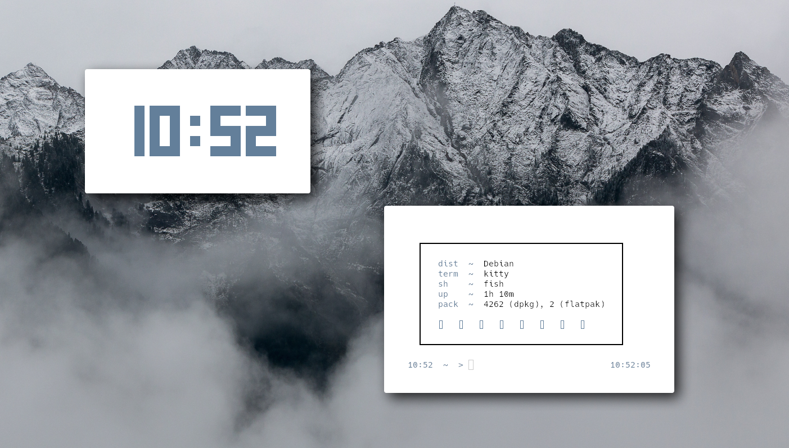
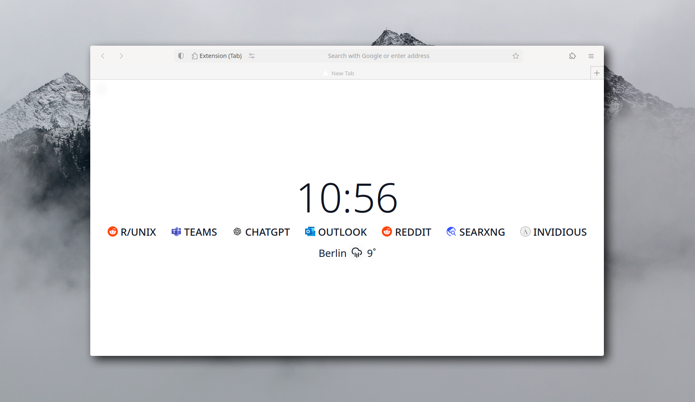
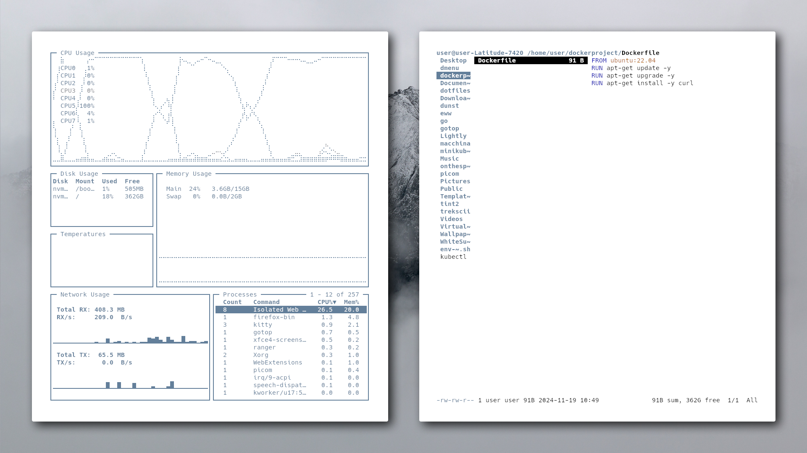

# 𝕚𝟛-𝕊𝕖𝕥𝕦𝕡
> **Winddow Manager**: [i3 Window Manager](https://i3wm.org/)

</li>
    </ul>
  

  

    
  

---

  

    
<strong>🌐 Optimized Firefox</strong>

    
Firefox is my browser of choice, optimized for a <strong>clean design</strong> and <strong>easy usability</strong>. I've customized it to create a <strong>streamlined, intuitive browsing experience</strong>, focusing on simplicity and efficiency. With this setup, Firefox provides a smooth, clutter-free interface.

  

  

    
  

---

  

    
<strong>🚀 Resource Efficiency</strong>

    
Optimized for performance and minimal resource usage. On average, my setup consumes between <strong>250 MB and 400 MB of RAM</strong>, depending on the installed packages and background services. This lightweight configuration maximizes system resources for essential tasks and keeps everything running smoothly.

  

  

    
  

## Wallpaper
  

  

    
  

---
### 🔑 Key Bindings

#### 📱 **Applications**

- **$mod+q** – Close window  
- **$mod+Return** – Open terminal (kitty)  
- **$mod+f** – Launch Firefox  
- **$mod+r** – Run rofi  
- **$mod+e** – Open file manager (PCManFM)  
- **$mod+c** – Launch Visual Studio Code (Codium)
- **$mod+Escape** – Lock screen (i3lock)

#### ⚙️ **Miscellaneous**

- **$mod+Shift+c** – Reload i3 configuration  
- **$mod+Shift+e** – Exit i3 session
